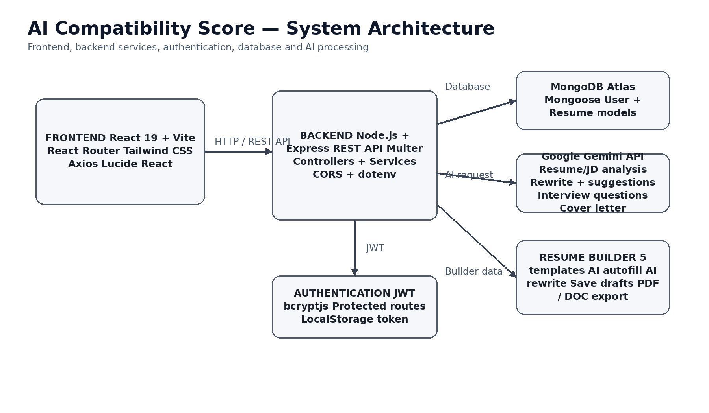
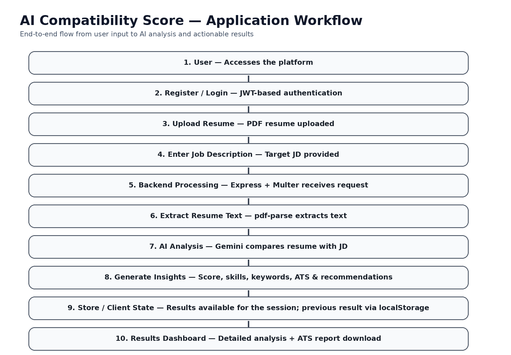
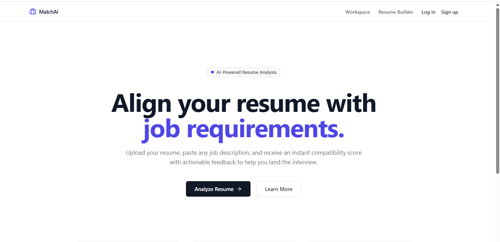
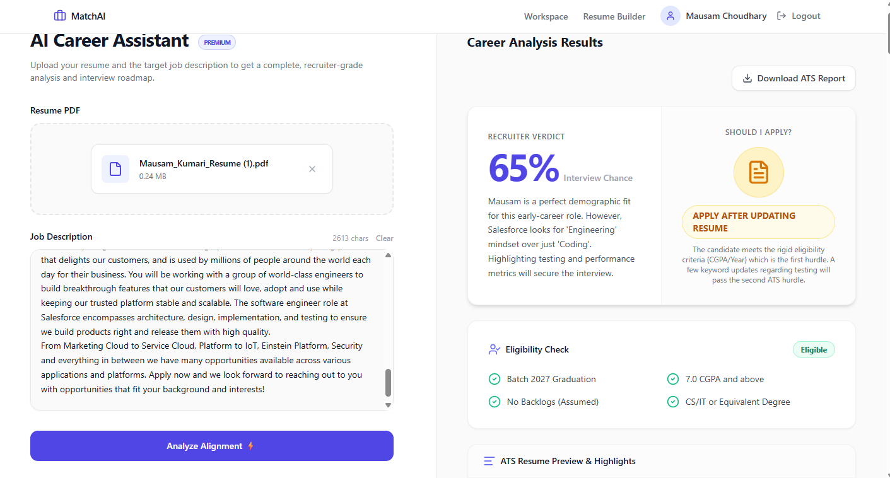
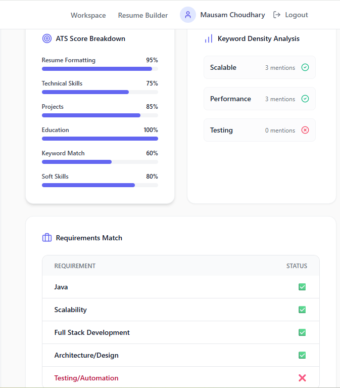
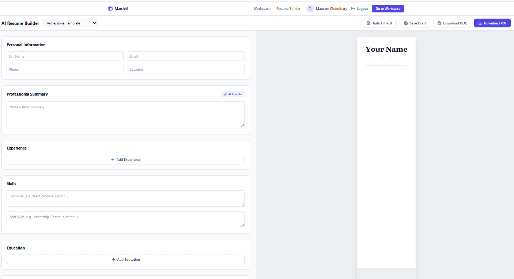

# 🤖 AI Compatibility Score

### AI-Powered Resume & Job Matching Platform

AI Compatibility Score is a full-stack web application that uses **Google Gemini AI** to analyze a candidate's resume against a specific Job Description.

It generates a **compatibility score, matching skills, missing keywords, ATS insights, and personalized recommendations** to help candidates improve their resume before applying for a job.

### 🚀 Live Demo

[Try AI Compatibility Score →](https://ai-compatibility-score-6ibclw422-mau-projects-c34a89af.vercel.app)

### 📂 GitHub Repository

[View Source Code →](https://github.com/Mausam-Kumari9534/ai-compatibility-score)

---

## ✨ Key Features

- 📄 Upload resume in PDF format
- 🎯 Compare resume with Job Description
- 🤖 AI-powered analysis using Google Gemini
- 📊 Generate compatibility score
- 🔑 Identify missing skills and keywords
- 📈 ATS-oriented analysis
- 💡 Personalized resume improvement suggestions
- ✍️ AI-powered resume rewriting
- 📨 AI-generated cover letters
- 🎤 Interview preparation questions
- 📝 AI-powered Resume Builder
- 📥 Export resume as PDF/DOC
- 🔐 JWT-based authentication
- 💾 Save and manage resume drafts

---

## 🛠️ Tech Stack

| Technology | Purpose |
|---|---|
| React.js | Frontend |
| Tailwind CSS | UI Styling |
| Node.js | Backend Runtime |
| Express.js | REST APIs |
| MongoDB | Database |
| Mongoose | Database Modeling |
| JWT | Authentication |
| bcryptjs | Password Hashing |
| Google Gemini AI | AI Analysis |
| pdf-parse | Resume Text Extraction |
| Multer | PDF Upload Handling |
| Vite | Frontend Build Tool |
| Vercel | Deployment |

---

## 🎯 Problem & Solution

### Problem

Job seekers often struggle to understand whether their resume matches a specific job description and which skills or keywords are missing.

### Solution

AI Compatibility Score analyzes the resume against the target Job Description using Google Gemini AI and provides a compatibility score, matching skills, missing keywords, ATS insights, and personalized recommendations.

## 📌 Project Overview

The platform helps job seekers understand how well their resume matches a particular job description.

The user uploads a resume and provides a Job Description. The backend extracts the resume text and sends it along with the Job Description to Google Gemini AI.

The AI analyzes both inputs and generates a structured report containing compatibility score, matching skills, missing keywords, ATS insights, and personalized recommendations.

---

## 🔄 How It Works

1. User registers or logs in.
2. User uploads a PDF resume.
3. User enters the target Job Description.
4. Backend extracts text from the resume.
5. Resume and Job Description are analyzed using Gemini AI.
6. AI generates compatibility score and detailed insights.
7. Results are displayed on the dashboard.
8. User can improve the resume using AI suggestions.

---

## 🏗️ System Architecture



---

## 🔄 Application Workflow



---

## 📝 Resume Builder

The application also provides an AI-powered Resume Builder where users can:

- Create professional resumes
- Choose from multiple templates
- Edit resume sections
- Get AI suggestions
- Rewrite resume content
- Save resume drafts
- Export resumes as PDF/DOC

---

## 📸 Screenshots

### 🏠 Home Page



### 📊 Resume Analysis



### 🎯 Compatibility Result



### 📝 Resume Builder



---

## 🚀 Installation & Setup

### Clone the Repository

```bash
git clone https://github.com/Mausam-Kumari9534/ai-compatibility-score.git
cd ai-compatibility-score
