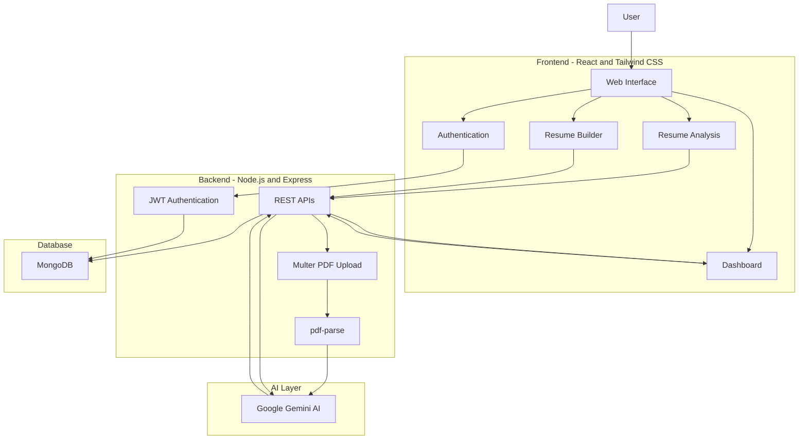
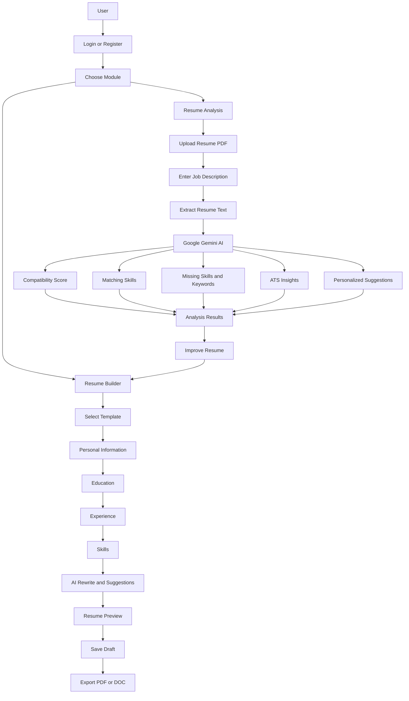

# 🤖 AI Compatibility Score

## AI-Powered Resume & Job Matching Platform

AI Compatibility Score is a full-stack AI-powered career platform that helps job seekers analyze, improve, and build professional resumes.

The platform uses **Google Gemini AI** to analyze a candidate's resume against a specific Job Description and generates a compatibility score, matching skills, missing keywords, ATS insights, and personalized recommendations.

It also provides an integrated **Resume Builder** where users can create, customize, improve, save, and export professional resumes.

---

## 🚀 Live Demo

[Try AI Compatibility Score](https://ai-compatibility-score-6ibclw422-mau-projects-c34a89af.vercel.app/)

## 📂 GitHub Repository

[View Source Code](https://github.com/Mausam-Kumari9534/ai-compatibility-score)

---

## ✨ Key Features

### 🎯 Resume & Job Matching

- 📄 Upload resume in PDF format
- 🎯 Compare resume with Job Description
- 🤖 AI-powered analysis using Google Gemini
- 📊 Generate resume compatibility score
- 🔑 Identify matching skills
- 🔍 Identify missing skills and keywords
- 📈 ATS-oriented resume analysis
- 💡 Personalized resume improvement suggestions

### ✍️ AI Career Assistance

- ✍️ AI-powered resume rewriting
- 📨 AI-generated cover letters
- 🎤 Interview preparation questions
- 💡 AI-powered career recommendations

### 📝 Resume Builder

- 📝 Create professional resumes
- 🎨 Choose from multiple resume templates
- ✏️ Edit resume sections
- ✨ Get AI-powered suggestions
- 🔄 Rewrite resume content using AI
- 💾 Save and manage resume drafts
- 📥 Export resumes as PDF/DOC

### 🔐 User & Data Management

- 🔐 JWT-based authentication
- 🔒 Password hashing using bcryptjs
- 💾 MongoDB-based data storage
- 👤 User-specific resume and analysis data

---

## 🛠️ Tech Stack

| Technology | Purpose |
|---|---|
| React.js | Frontend UI |
| Tailwind CSS | UI Styling |
| Node.js | Backend Runtime |
| Express.js | REST API Development |
| MongoDB | Database |
| Mongoose | Database Modeling |
| JWT | Authentication |
| bcryptjs | Password Hashing |
| Google Gemini AI | Resume & Career Analysis |
| pdf-parse | Resume Text Extraction |
| Multer | PDF Upload Handling |
| Vite | Frontend Build Tool |
| Vercel | Deployment |

---

## 🎯 Problem & Solution

### Problem

Job seekers often struggle to understand whether their resume matches a specific job description. They may also miss important skills, keywords, ATS requirements, and professional resume formatting.

### Solution

AI Compatibility Score provides an AI-powered platform that analyzes a resume against a target Job Description and generates a compatibility score, matching skills, missing keywords, ATS insights, and personalized recommendations.

In addition, the integrated Resume Builder allows users to create and customize professional resumes and export them for job applications.

---

## 📌 Project Overview

AI Compatibility Score is designed as a complete career preparation platform with two major modules:

### 1. 🎯 AI Resume & Job Matching

Users can upload their resume and enter a target Job Description. The backend extracts the resume text and sends the resume content along with the Job Description to Google Gemini AI.

The AI analyzes both inputs and generates structured insights such as:

- Compatibility Score
- Matching Skills
- Missing Skills
- Missing Keywords
- ATS Insights
- Resume Improvement Suggestions

### 2. 📝 Resume Builder

The platform also provides a dedicated Resume Builder that allows users to:

- Create professional resumes
- Select resume templates
- Add personal information
- Add education and experience
- Add technical and soft skills
- Edit resume sections
- Use AI rewriting suggestions
- Save resume drafts
- Export resumes as PDF/DOC

---

## 🔄 How It Works

### Resume Analysis Flow

1. User registers or logs in.
2. User uploads a PDF resume.
3. User enters the target Job Description.
4. Backend receives the uploaded resume.
5. `pdf-parse` extracts text from the PDF.
6. Resume text and Job Description are sent to Google Gemini AI.
7. Gemini analyzes the candidate's profile against the Job Description.
8. The application generates a compatibility score and detailed insights.
9. Results are displayed on the dashboard.
10. User can improve the resume using AI suggestions.

### Resume Builder Flow

1. User opens the Resume Builder.
2. User selects a resume template.
3. User enters personal information.
4. User adds education, experience, and skills.
5. User can use AI-powered rewriting suggestions.
6. Resume preview is updated dynamically.
7. User can save the resume draft.
8. User can export the final resume as PDF/DOC.

---

## 🏗️ System Architecture

## 🔄 Application Workflow

The application provides two main workflows: **AI Resume Analysis** and **Resume Builder**.

## 📸 Screenshots

### 🏠 Home Page

### 📊 Resume Analysis

### 🎯 Compatibility Result

### 📝 Resume Builder

